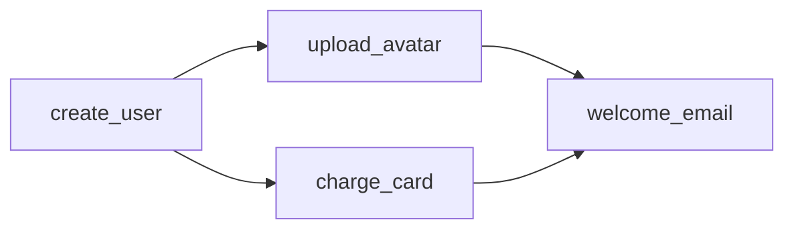

elixir는 erlang의 모든 데이터 구조를 사용할 수 있다.

## Queue

### queue

FIFO(선입선출)식 데이터 구조. `:queue.in/2`, `:queue.out/1` 같은 일반 enqueue/dequeue는 amortized O(1)이다. `:queue.len/1`, `:queue.member/2`, `:queue.filter/2`, `:queue.fold/3`, `:queue.split/2`처럼 전체를 봐야 하는 함수는 O(n)이다.

```elixir
ex(1) > my_queue = :queue.new()
# {[], []}
iex(2) > my_queue = :queue.in(1, my_queue)
# {[1], []}
iex(3) > my_queue = :queue.in(2, my_queue)
# {[2], [1]}
iex(4) > {{:value, my_value}, my_queue} = :queue.out(my_queue)
# {{:value, 1}, {[], [2]}}
iex(5) > {{:value, my_value}, my_queue} = :queue.out(my_queue)
# {{:value, 2}, {[], []}}
iex(6) > {:empty, my_queue} = :queue.out(my_queue)
# {:empty, {[], []}}
```

## Sets

유니크한 값 그룹
OTP 27+에서는 `.is_equal/2`, `.map/2`, `.filtermap/2`를 쓸 수 있다.

### sets

https://www.erlang.org/doc/apps/stdlib/sets.html

OTP 28+에서는 version 2가 기본값이다. OTP 24-27 compatibility를 문서화해야 할 때만 `version: 2`를 명시한다. 항상 version: 2를 쓴다고 생각하라

set의 내부 표현은 opaque로 다룬다. 예제 출력이 `%{}`처럼 보이더라도 그 구조에 기대서 pattern matching 하지 않는다.

set 내부 표현 비교(`==`, `===`) 대신 의도에 맞는 API로 비교한다.

```elixir
iex(1) > unique_emails = :sets.new()
# %{}
iex(2) > unique_emails = :sets.add_element("john@cool-app.com", unique_emails)
# %{"john@cool-app.com" => []}
iex(3) > unique_emails = :sets.add_element("jane@cool-app.com", unique_emails)
# %{"jane@cool-app.com" => [], "john@cool-app.com" => []}
iex(4) > unique_emails = :sets.add_element("jane@cool-app.com", unique_emails)
# %{"jane@cool-app.com" => [], "john@cool-app.com" => []}
```

```elixir
iex(1)> set = :sets.from_list([1, 2, 3, 4])
iex(2)> set = :sets.filtermap(fn
...(2)>   n when rem(n, 2) == 0 -> {true, n * 10}
...(2)>   _ -> false
...(2)> end, set)
iex(3)> set |> :sets.to_list() |> Enum.sort()
# [20, 40]
```

### ordsets

https://www.erlang.org/doc/apps/stdlib/ordsets.html

정렬된 sets.
sets.to\_list는 순서를 보장하지 않지만, ordsets.to\_list는 순서가 보장됨
`:sets`는 일반적인 set 기본값이고, `:ordsets`는 작거나 이미 정렬된 list와 자주 오가거나 `intersection/2`가 많은 경우에 고려한다.

```elixir
iex(1) > set = :ordsets.new()
# []
iex(2) > set = :ordsets.add_element("Jane Smith", set)
# ["Jane Smith"]
iex(3) > set = :ordsets.add_element("Alex Koutmos", set)
# ["Alex Koutmos", "Jane Smith"]
iex(4) > set = :ordsets.add_element("Alex Koutmos", set)
# ["Alex Koutmos", "Jane Smith"]
iex(5) > :ordsets.to_list(set)
# ["Alex Koutmos", "Jane Smith"]
```

### gb\_sets

https://www.erlang.org/doc/apps/stdlib/gb\_sets.html

균형 트리 기반의 sets
다른 sets는 === 비교를 하는 반면, gb\_sets는 == 비교를 하기 때문에 42와 42.0를 구분해야 하는 경우 적합하지 않다. 일반적으로는 3~4배 느리지만, 크기가 다른 sets들을 포함하거나, 대규모 세트, 혹은 한 세트를 재귀적으로 테스트 하는 경우는 수십 수백배 빨라질 수 있다.

이미 정렬된 unique list에서 만들 때는 `:gb_sets.from_ordset/1`가 빠르다. OTP 29부터는 입력이 정렬돼 있지 않으면 `badarg`가 난다. 정렬 여부가 불확실하면 `:gb_sets.from_list/1`를 쓴다.

```elixir
ex(1) > set = :gb_sets.new()
# {0, nil}
iex(2) > set = :gb_sets.add_element(42, set)
# {1, {42, nil, nil}}
iex(3) > set = :gb_sets.add_element(2, set)
# {2, {42, {2, nil, nil}, nil}}
iex(4) > set = :gb_sets.add_element(10, set)
# {3, {42, {2, nil, {10, nil, nil}}, nil}}
iex(5) > set = :gb_sets.add_element(10, set)
# {3, {42, {2, nil, {10, nil, nil}}, nil}} ②
iex(6) > :gb_sets.to_list(set) ③
# [2, 10, 42]
```

## Array

### array

https://www.erlang.org/doc/apps/stdlib/array.html

non-negative integer key가 dense하게 쓰이고 index 기반 접근이 핵심이면 map보다 `:array`가 나을 수 있다. 반대로 sparse key나 atom/string key 중심 dictionary면 map을 먼저 쓴다.

```elixir
iex(1) > array = :array.new()
# {:array, 0, 10, :undefined, 10}
iex(2) > array = :array.set(0, "Alex Koutmos", array) ②
# {:array, 1, 10, :undefined,
#		{"Alex Koutmos", :undefined, :undefined, :undefined, :undefined,
#		:undefined, :undefined, :undefined, :undefined, :undefined}
# }
iex(3) > array = :array.set(1, "Bob Smith", array)
# {:array, 2, 10, :undefined,
# 	{"Alex Koutmos", "Bob Smith", :undefined, :undefined, :undefined,
# 	:undefined, :undefined, :undefined, :undefined, :undefined}
# }
ex(4) > array = :array.set(2, "Jannet Angelo", array)
# {:array, 3, 10, :undefined,
# 	{"Alex Koutmos", "Bob Smith", "Jannet Angelo", :undefined, :undefined,
# 	:undefined, :undefined, :undefined, :undefined, :undefined}
# }
iex(5) > :array.get(1, array) ③
"Bob Smith"
iex(6) > :array.get(2, array)
"Jannet Angelo"
```

## Maps

### maps 선택 기준

https://www.erlang.org/doc/system/maps.html

Elixir의 map도 BEAM map이다. 작은 struct 대체 자료형, dictionary, set 표현 모두에서 성능 특성이 다르다.

- key가 compile-time에 정해진 작은 record-like 자료라면 map syntax를 쓴다. 여러 key는 한 번에 match/update 한다.
- record-like map은 32개 이하 key를 유지하는 편이 좋다. 32개를 넘으면 large map(HAMT)이 되고 memory overhead와 sharing 특성이 달라진다.
- 이미 존재해야 하는 key는 `=>`보다 `:=` update를 쓴다. 오타를 빨리 잡고 small map에서 더 낫다.
- default value를 많이 쓰는 `Map.get(map, key, default)` 반복은 피한다. 필요한 default set을 map으로 만들고 `:maps.merge/2`로 한 번에 채우는 쪽이 key sharing에 유리할 수 있다.
- key가 non-negative integer이고 dense하게 쓰이면 `:array`가 map보다 나을 수 있다.
- set 표현은 보통 `:sets`가 낫다. 다만 intersection-heavy workload는 `:ordsets`나 `:gb_sets`가 더 나을 수 있다.

```elixir
def new_user_state do
  %{id: nil, email: nil, status: :draft}
end

state =
  new_user_state()
  |> then(&%{&1 | id: 1, email: "john@example.com"})
```

OTP 29에서는 같은 map을 순회할 때 API별 순서 차이가 줄었다. 그래도 map order는 business rule로 삼지 않는다.

```elixir
map = %{b: 2, a: 1}

map
|> :maps.iterator(:ordered)
|> :maps.to_list()
# [a: 1, b: 2]
```

### timer

https://www.erlang.org/doc/apps/stdlib/timer.html

시간을 측정하는데 유용하다

```elixir
large_dataset = Enum.to_list(1..2_500_000)

{enum_time, enum_result} =
  :timer.tc(fn ->
    large_dataset
    |> Enum.reject(&(rem(&1, 2) == 1))
    |> Enum.map(&(&1 * 2))
    |> Enum.sum()
  end)

{stream_time, stream_result} =
  :timer.tc(fn ->
    large_dataset
    |> Stream.reject(&(rem(&1, 2) == 1))
    |> Stream.map(&(&1 * 2))
    |> Enum.sum()
  end)

IO.inspect(enum_result == stream_result, label: "Equal results")
#   Equal results: true

enum_time
|> System.convert_time_unit(:microsecond, :millisecond)
|> IO.inspect(label: "Enum time (ms)")
# Enum time (ms): 1497

stream_time
|> System.convert_time_unit(:microsecond, :millisecond)
|> IO.inspect(label: "Stream time (ms)")
# Stream time (ms): 1043
```

### use case: binary\_to\_term, term\_to\_binary

term이란 elixir, erlang에서 사용하는 데이터 조각이다.
신뢰할 수 있는 다른 어플리케이션등으로 데이터를 전송해야 하는 경우 유용하다.
신뢰할 수 없는 경우에는 꼭 `:safe` 옵션을 준다. 단, `:safe`는 runtime resource 공격을 막는 옵션이지 application-level validation은 아니다. 외부 입력이면 schema validation을 따로 하고, 저장/전송 경로가 신뢰 경계 밖이면 서명이나 MAC을 붙인다.

```elixir
ex(1) > my_data = %{name: "John Smith", age: 42, favorite_lang: :elixir}
# %{age: 42, favorite_lang: :elixir, name: "John Smith"}
iex(2) > base_64_serialized = my_data
		|> :erlang.term_to_binary()
		|> Base.encode64()
# "g3QAAAADZAADYWdlYSpkAA1mYXZvcml0ZV9sYW5nZAAGZWxpeGlyZAAEbmFtZW0AAAAKSm9obiBTbWl0aA=="
iex(3) > base_64_serialized |> Base.decode64!() |> :erlang.binary_to_term([:safe])
# %{age: 42, favorite_lang: :elixir, name: "John Smith"}
```

### md5

해시를 빠르게 생성할 수 있으므로 파일의 변경을 추적하는 상황에서 유용하다. 보안 목적이면 MD5를 쓰지 말고 `:crypto.hash(:sha256, data)` 같은 현대 hash를 쓴다.

```elixir
iex(1) > "./elixir_patterns.pdf"
		|> File.read!()
		|> :erlang.md5()
# <<168, 142, 134, 106, 203, 208, 151, 185, 200, 125, 31, 103, 26, 184, 157, 110>>
```

### phash2

데이터를 분할하거나 프로세스/노드 그룹에 작업을 분산해야 하는 경우 우용하다.
아래 예에서는 term에 대해서 0~9사이의 인덱스에 각각의 작업이 분배된 것이다.
약간의 차이는 있지만 얼추 균등하게 작업이 분배된 것을 볼 수 있다.

```elixir
iex(1) > 1..100_000 |>
...(1) > Enum.reduce(%{}, fn number, acc ->
...(1) > 	index = :erlang.phash2("Some data - #{number}", 10) ①
...(1) > 	Map.update(acc, index, 1, &(&1 + 1))
...(1) > end)
# %{
# 0 => 9961,
# 1 => 10092,
# 2 => 10026,
# 3 => 9929,
# 4 => 10000,
# 5 => 10112,
# 6 => 10121,
# 7 => 9844,
# 8 => 10078,
# 9 => 9837
# }
```

### memory

```elixir
iex(8)> :erlang.memory()
[
  total: 38873548,
  processes: 15389696,
  processes_used: 15389552,
  system: 23483852,
  atom: 442553,
  atom_used: 427725,
  binary: 736448,
  code: 7909922,
  ets: 547960
]
```

### system\_info

```elixir
iex(9)> :erlang.system_info(:system_version)
~c"Erlang/OTP 27 [erts-15.0.1] [source] [64-bit] [smp:10:10] [ds:10:10:10] [async-threads:1] [jit]\n"
iex(2) > :erlang.system_info(:atom_count)
14091
iex(3) > :erlang.system_info(:atom_limit)
1048576
iex(4) > :erlang.system_info(:ets_count)
23
iex(5) > :erlang.system_info(:schedulers)
10
iex(6) > :erlang.system_info(:emu_flavor)
:jit
```

## 가변 데이터

### [Digraph](https://www.erlang.org/doc/apps/stdlib/digraph.html)

방향이 있는 그래프로써 Mutable 자료형이다.
상태는 [ETS](https://elixirschool.com/ko/lessons/storage/ets)에 지속된다.

Digraph는 "데이터 사이에 방향성 있는 관계가 있고, 그 관계를 계속 질의해야 할 때" 쓴다. 단순히 순서대로 실행할 작업 목록이면 list나 queue가 낫고, key-value lookup이면 map이나 ETS가 낫다. Digraph가 적합한 경우는 vertex와 edge 자체가 문제의 핵심일 때다.

적합한 상황:

- dependency graph: 작업, build step, migration, workflow step 사이의 선후 관계를 표현하고 `:digraph_utils.topsort/1`로 실행 순서를 구할 때.
- DAG 검증: cycle이 있으면 안 되는 구조를 만들고 `:acyclic`, `:digraph_utils.is_acyclic/1`로 검증할 때.
- reachability 질의: A에서 B로 갈 수 있는지, 특정 node의 부모/자식/입구/출구가 무엇인지 반복해서 물어볼 때.
- runtime graph: compile-time에 고정된 구조가 아니라 실행 중 vertex/edge를 추가, 삭제하면서 분석해야 할 때.
- graph algorithm을 직접 짜기보다 OTP가 제공하는 `:digraph_utils`를 쓰는 편이 더 명확할 때.

피하는 편이 나은 상황:

- 단순 pipeline: `a -> b -> c`처럼 한 줄이면 list가 낫다.
- 작은 tree: 부모-자식 관계만 있고 cross-edge가 없으면 nested struct/map이 더 단순하다.
- 장기 저장 데이터: `:digraph`는 ETS 기반 mutable runtime structure다. 영속 저장 format으로 쓰기보다는 DB나 파일에 edge list를 저장하고 필요할 때 digraph로 로드한다.
- 다중 process 공유 상태: graph를 여러 process가 동시에 갱신해야 하면 ownership process나 ETS 설계를 먼저 잡는다. `:digraph` 자체를 여기저기 넘겨 mutation boundary를 흐리게 만들지 않는다.

아래와 같은 workflow를 elixir의 Digraph로 만들어보자.



```elixir
# acyclic(비순환)
iex(1) > my_workflow = :digraph.new([:acyclic])
# {
# 	:digraph,
#		#Reference<0.1888117864.2375680005.579>,
# 	#Reference<0.1888117864.2375680005.580>,
# 	#Reference<0.1888117864.2375680005.581>,
# 	false
# }

iex(2) > do_work = fn step ->
...(2) > 		fn ->
...(2) > 			IO.puts("Running the following step: " <> step)
...(2) >
...(2) > 			# Simulate load
...(2) > 			Process.sleep(500)
...(2) > 		end
...(2) > end

iex(3) > :digraph.add_vertex(my_workflow, :create_user, do_work.("Create user in database"))
# :create_user
iex(4) > :digraph.add_vertex(my_workflow, :upload_avatar, do_work.("Upload image to S3"))
# :upload_avatar
iex(5) > :digraph.add_vertex(my_workflow, :charge_card, do_work.("Bill credit card"))
# :charge_card
iex(6) > :digraph.add_vertex(my_workflow, :welcome_email, do_work.("Send welcome email"))
# :welcome_email

iex(7) > :digraph.add_edge(my_workflow, :create_user, :upload_avatar) ②
# [:"$e" | 0]
iex(8) > :digraph.add_edge(my_workflow, :create_user, :charge_card)
# [:"$e" | 1]
iex(9) > :digraph.add_edge(my_workflow, :upload_avatar, :welcome_email)
# [:"$e" | 2]
iex(10) > :digraph.add_edge(my_workflow, :charge_card, :welcome_email)
# [:"$e" | 3]

ex(11) > :digraph.info(my_workflow) ①
# [cyclicity: :acyclic, memory: 1779, protection: :protected]
iex(12) > :digraph.source_vertices(my_workflow) ②
# [:create_user]
iex(13) > :digraph.sink_vertices(my_workflow) ③
# [:welcome_email]
iex(14) > :digraph_utils.is_acyclic(my_workflow) ④
# true
iex(15) > my_workflow
...(15) > 	|> :digraph_utils.topsort()
...(15) > 	|> Enum.each(fn vertex ->
...(15) >				{_vertex, work_function} = :digraph.vertex(my_workflow, vertex)
...(15) > 			work_function.()
...(15) > 	end)


Running the following step: Create user in database
Running the following step: Bill credit card
Running the following step: Upload image to S3
Running the following step: Send welcome email
# :ok
iex(16) > :digraph.delete(my_workflow) ⑥
# true
```

add\_vertex:  정점을 생성
add\_edge: 방향을 긋는다.
info:  얼마나 많은 메모리를 소비하는지와 세부 사항을 확인할 수 있다.
source\_vertices: enter 정점 나열
sink\_vertices: exit 정점 나열
is\_acyclic: 순환적이지 않은지 확인
delete: ets 테이블을 삭제하고 정리
digraph\_utils.topsort: 그래프를 위상 정렬. 부모 정점이 자식 정점보다 먼저 방문하도록 하여 모든 종속성을 평가할 수 있도록 한다.

### :atomics, :counters module

이들은 가변 데이터이며 데이터 구조라기보단 그 이상의 것이다.
목적 기반 저장 메커니즘이며 고도로 최적화하는 사용 사례가 필요할때를 위해 존재한다.
특히 :atomics, :counters 모듈은 가능한 성능이 좋은 방식으로 숫자 배열에 더하고 빼는 작업을 하기 위해 특별히 설계된 하드웨어 가속 모듈이다.
차이는 :atomics는 많은 변경이 일어나더라도 데이터 불일치가 발생하지 않고
:counters는 읽기 불일치를 대가로 추가적인 성능을 얻을 수 있다.

```elixir
iex (1) > existing_user_index = 1
1

iex (2) > new_user_index = 2
2

## :atomic.new/2를 사용하여 값이 부호 없는 정수인 새로운 Atomic 객체를 생성합니다. index1은 신규 사용자 상호작용, 2는 기존 사용자 상호작용을 집계
iex (3) > my_atomic = :atomics.new(2, signed: false) ①
#Reference<0.2046450538.1649803274.4215>


iex (4) > 1..100_000 |>
## 10만개의 항목을 500개의 동시 작업으로 Stream 실행
... (4) > Task.async_stream(
... (4) >   fn _ ->
... (4) >     user_type = Enum.random([:existing_user, :new_user])
... (4) >
... (4) >     case user_type do ②
... (4) >       :existing_user -> :atomics.add(my_atomic, existing_user_index, 1)
... (4) >       :new_user -> :atomics.add(my_atomic, new_user_index, 1)
... (4) >     end
... (4) >   end,
... (4) >   max_concurrency: 500
... (4) > ) |>
... (4) > Stream.run() ③
:ok

iex(9)> :atomics.get(my_atomic, existing_user_index)
50146

iex(10)> :atomics.get(my_atomic, new_user_index)
49854
```

### :persistent\_term

https://www.erlang.org/doc/apps/erts/persistent\_term.html

읽기가 매우 많고 거의 바뀌지 않는 전역 term에 쓴다. `get/1`은 constant time이고 caller heap으로 복사하지 않는다. 대신 `put/2`나 `erase/1`은 global GC를 유발할 수 있으므로 자주 바뀌는 config, feature flag, request-scoped data에는 쓰지 않는다.

OTP 28.4+에는 `:persistent_term.put_new/2`가 있다. boot-time registry나 한 번만 설정돼야 하는 값에 맞다.

### 저장소 모듈

:ets - 메모리 기반 저장소
:dets - 디스크 기반 저장소, ets와 1:1 호환 가능함

### ETS OTP 27+ traversal / update

https://www.erlang.org/doc/apps/stdlib/ets.html

큰 table을 순회할 때 `first/next` 후 `lookup`을 직접 붙이지 말고 OTP 27+ lookup traversal API를 먼저 본다.

```elixir
def collect_ordered(tab) do
  Stream.unfold(:ets.first_lookup(tab), fn
    :"$end_of_table" ->
      nil

    {key, objects} ->
      {{key, objects}, :ets.next_lookup(tab, key)}
  end)
  |> Enum.to_list()
end
```

missing key일 때 default tuple을 넣고 특정 element만 갱신하려면 OTP 27+ `:ets.update_element/4`가 직접적인 선택지다.

```elixir
tab = :ets.new(:counts, [:set])

:ets.update_element(tab, :page_view, {2, 1}, {:page_view, 0})
# true

:ets.lookup(tab, :page_view)
# [page_view: 1]
```

counter만 올리는 경우는 기존처럼 `:ets.update_counter/4`가 더 잘 맞는다.

### 암호화 모듈

:crypto.hash, :crypto.mac,

## References

- https://www.erlang.org/blog/highlights-otp-27/
- https://www.erlang.org/news/180
- https://www.erlang.org/blog/highlights-otp-28/
- https://www.erlang.org/news/188
- https://www.erlang.org/blog/highlights-otp-29/
- https://www.erlang.org/doc/system/maps.html
- https://www.erlang.org/doc/apps/stdlib/sets.html
- https://www.erlang.org/doc/apps/stdlib/ets.html
