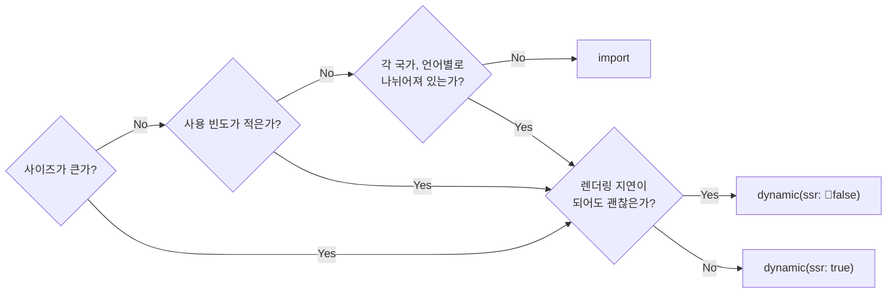

---
{"publish":true,"created":"2025-11-27T06:39:55Z","modified":"2025-12-03T03:42:22Z","cssclasses":""}
---


사내 가이드로 작성
nextjs 14 버전 기준으로 작성되었습니다.

## 배포 플랫폼 최적화

nextjs는 기본적으로 vercel에 최적화된 모습을 보인다. 그래서 다른 배포 플랫폼에서는 nextjs의 이점을 많이 못살리는 경우가 많은데 최대한 vercel 에서 돌아가는 nextjs처럼 최적화된 형태를 제공하려는 오픈소스 OpenNext가 있다. openNext를 사용하면 AWS에서도 최적화된 nextjs 배포를 할 수 있습니다.

[https://opennext.js.org/](https://opennext.js.org/)

## 렌더링 최적화

### use client에 대한 오해

`use client`는 오직 클라이언트 사이드 렌더링이 아닙니다. react의 정말 햇갈리는 부분인데요.. `use hybrid`가 더 정확한 표현입니다. 서버 측에서 초기 렌더링을 시도하고 클라이언트 사이드로 hydration이 이루어집니다.

진정한 오직 클라이언트 사이드는 다음과 같습니다.

1. ssr이 false인 dynamic(lazy) 컴포넌트

    ```tsx
    import dynamic from "next/dynamic"
    import { lazy } from "react"
    
    const DynamicClientComponent = dynamic(() => import("./ClientComponent"), {
      ssr: false,
    });
    // or
    const LazyClientComponent = lazy(() => import("./ClientComponent"));
    ```

    두 방식의 차이는 dynamic은 ssr를 선택할 수 있으며 제 경험에서 dynamic인 경우 내부적으로 nextjs측에서 캐싱하는 것 같은데, 그로 인한 버그가 발생하는 경우에는 react의 lazy를 사용했습니다.
    
2. 오직 클라이언트에서만 알 수 있는 정보에 의존하여 렌더링되는 하위 컴포넌트 - (예제의 ChildComponent, 가급적 피해야 합니다!)
   이 경우 위에 dynamic이랑 실질적으로는 같으면서 import는 초기에 합니다.

    ```tsx
    import ChildComponent from "./ChildComponent"
    
    function ParentComponent() {
    	const searchParams = useSearchParams()
    	const [currentScrollY, setCurrentScrollY] = useState(0)
    	// ... window.scrollY를 set하는 로직
    	
    	
    	return (
    		// 여기서 parent 부분은 서버측에서 미리 렌더링 됩니다.
    		<div className="parent">
    			{currentScrollY > 300 && <ChildComponent />}
    		</div>
    	)
    }
    ```

dynamic, lazy 로드시 추가적인 http 요청이 발생하므로 용량이 큰 컴포넌트(e.g 큰 Modal Content)에 사용하는 것이 좋습니다.
그 외의 컴포넌트들에서는 초기에 server, hybrid 렌더링이 최대한 되게끔 하는 것이 페이지 속도나 사용성 측면으로 좋습니다. **클라이언트 측에서만 알 수 있는 미디어 쿼리, 스크롤, 상태 값에 블로킹 되지 않고요!**

zustand 사용의 경우 context + provider과 함께 사용해야 hydration이 이루어져 초기 initial 값으로 SSR 렌더링이 가능해집니다~ ([zustand guide](https://zustand.docs.pmnd.rs/guides/nextjs#app-router))
그러므로 바로 보여져야 하는 화면에서는 가급적 provider를 써서 초기 서버 렌더링으로 보여주는 것이 좋아요.

**Dynamic 사용 케이스**

꼭 아래 다이어그램처럼 하는 것 보다는 정도에 따라서 유동적인 판단을 내리는 것이 좋습니다.



### 다국어 컴포넌트 처리

다국어별, 다국가별 컴포넌트들은 매치되지 않는 이상 렌더링 할 필요가 없으므로 컴포넌트가 아주 작지 않은 이상 가급적 dynamic으로 가져오는 것이 좋습니다.

❌ 아래처럼 할 시 해당 컴포넌트 로드시 모든 다국어 컴포넌트가 번들에 포함되어 용량이 커집니다.

```tsx
import ComponentUs from "./ComponentUs"
import ComponentKr from "./ComponentKr"
import ComponentCn from "./ComponentCn"

function Parent() {
	const { country } = useParams()
	
	if(country === "us") return <ComponentUs />
	if(country === "kr") return <ComponentKr />
	if(country === "cn") return <ComponentCn />
}
```

🟢 이렇게 하면 각 country 시에만 hit시에만 추가 번들을 가져옵니다. props로 params(country, lang)를 받으면 더욱 좋습니다. [(참고링크: layout, page에서 params, searchParams 읽기, nexjs v14는 Before 참고)](https://nextjs.org/docs/app/guides/upgrading/version-15#params--searchparams)

```tsx
import dynamic from "next/dynamic"

const DynamicComponentUs = dynamic(() => import("./ComponentUs"))
const DynamicComponentKr  = dynamic(() => import("./ComponentKr"))
const DynamicComponentCn  = dynamic(() => import("./ComponentCn"))

function Parent({ country }: { country: "us" | "kr" | "cn" }) {
	
	if(country === "us") return <ComponentUs />
	if(country === "kr") return <ComponentKr />
	if(country === "cn") return <ComponentCn />
}
```

```tsx
// page or layout에서 params, searchParams를 server side에서 읽을 수 있습니다. 
type PageOrLayoutProps =  {
  children: React.ReactNode;
  params: { country: string };
}

function PageOrLayout({children, params}: PageOrLayoutProps) {
	return <Parent country={params.country} />
}
```

### ISR

[nextjs ISR 페이지 참고](https://nextjs.org/docs/app/guides/incremental-static-regeneration)

데이터가 최신화 되는게 중요한 페이지가 아니고 일정 주기로만 업데이트 되어도 괜찮다면 [ISR 방식](https://nextjs.org/docs/app/guides/incremental-static-regeneration) 사용을 고려해 보세요! 서버 리소스를 크게 아끼고 렌더링 속도도 챙길 수 있습니다. 다만 제약사항이 꽤 있어요.

**ISR 체크리스트**

1. 해당 페이지로 접속하는 사용자 수가 많은가?
2. 데이터가 매번 최신화되지 않아도 괜찮은가?
3. fetch하는 데이터가 많거나 시간이 오래 걸리는가?
4. 페이지가 너무 많이 생성되지는 않는가?
   예를 들어 다국어 5개 x 제품 200개면 1000개의 페이지가 생성될 수 있음 페이지가 많이 생성되고 그 만큼 리스크가 생길 수 있기 때문에 각 언어별로만 분기되는 페이지면 더 적용하기 좋음.

### SSG

위의 ISR 같은 증분 재생성 전략이 필요가 없는 static 페이지라면 SSG로 하는게 좋아요.
nextjs에서는 ISR 방식에서 캐시를 무제한으로 설정해서 우회적으로 SSG를 구현할 수 있어요.
cache옵션을 force-cache로 설정하면 가능해요.

[nextjs route config 참고](https://nextjs.org/docs/14/app/api-reference/file-conventions/route-segment-config)

## serarchParams을 통한 상태 관리

경로상의 차이는 없지만 화면상에는 차이가 있는 간단한 상태에(tab, modal 상태 같은) searchParams를 사용시 서버사이드에서 렌더링도 되면서 클라이언트 단과의 sync도 맞출 수 있어 좋습니다.

nextjs에서 searchParams를 변경하는 작업을 할때 아래 방법들이 각각의 문제가 있어서 가급적 [nuqs](https://nuqs.47ng.com/)를 쓰는게 좋습니다.

nextjs의 useRouter와 useSearchParams로 searchParams를 조작하면서 겪은 문제들이에요.
1. router.replace로 searchParams를 변경하면 스크롤이 맨 위로 튕기고 컴포넌트들 재렌더링 되면서 useEffect가 다시 실행되는 문제
2. 렌더링 이슈를 피하기 위해 window.history.replaceState로 변경하면 페이지 이동 전까지는 nextjs의 searchParams와 sync가 되지 않고 searchParams를 읽을때의 타이밍 이슈

그래서 nextjs에서 이런 문제들이 해결되기 전까지는 searchParams를 통한 상태관리를 하실때 nuqs를 쓰시는 것이 좋습니다..!
